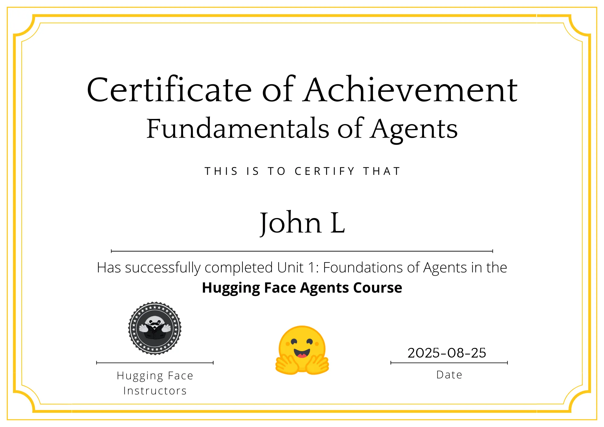

# Hugging Face Agents Course Capstone

# Performance Observations
The current agent scores 8/20 on the evaluation questions. Reasons for incorrect responses were summarised below:

1. Failed to follow instructions e.g. on task 99c9cc74-fdc8-46c6-8f8d-3ce2d3bfeea3. Here the model outputted the right ingredients but not in order. Another example is here
'3cef3a44-215e-4aed-8e3b-b1e3f08063b7' which requires ordering vegetables. It looks like failed to understand categories.

Can improve by using more powerful model or adjusting prompt

2. Web search failed to retrieve good answer
Relied on Google for web search answer and it failed on some occasions. For the task '8e867cd7-cff9-4e6c-867a-ff5ddc2550be', it returned the wrong studio discography so the final answer was wrong. Tavily also provided the wrong answer.

Challenge here is to find the right URL and also extract content from that page.

3. Failed on exact match / Formatting
For case task '2d83110e-a098-4ebb-9987-066c06fa42d0' the model outputted 'right' instead of 'Right' and was marked incorrect. Technically, the question was lower case so the agent's answer should be marked as correct.

More examples are: 
- '1f975693-876d-457b-a649-393859e79bf3'
- 'bda648d7-d618-4883-88f4-3466eabd860e'

4. Content Understanding
The chess board was a tough problem for the agent solve requiring image understanding but then also chess reasoning. It failed with Gemini 2.5 flash

5. Multi-part queries
Some questions are multi-part and the agent didn't have a good method to break these down into steps and to complete each one. 

For example '3f57289b-8c60-48be-bd80-01f8099ca449', the agent needed to first find a name and then find more specific information. 

Another example was 'cabe07ed-9eca-40ea-8ead-410ef5e83f91', which was a multi-step search.

6. Lacking tools
Processing excel file